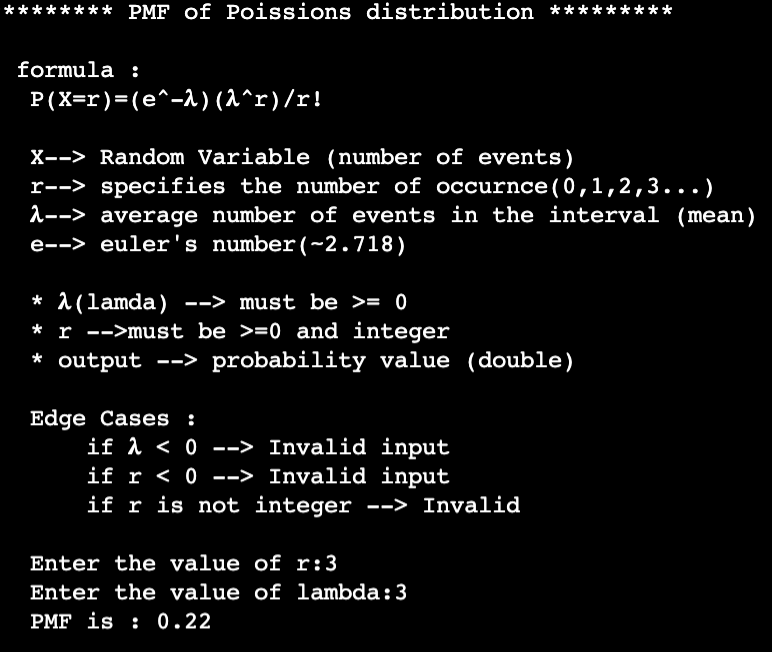

# 📊 Poisson Distribution PMF (Java)

<p align="center">
  <b>High-quality Java implementation of Poisson PMF with mathematical depth and practical relevance</b>
</p>

<p align="center">
  
  
  
  
</p>

---

## 📌 Overview

This project provides a **robust and modular implementation** of the **Poisson Probability Mass Function (PMF)** in Java.

It is designed not just as a coding project, but as a **bridge between theory and real-world statistical modeling**.

---

## 📦 Quick Access

<p align="center">
  <a href="https://github.com/your-username/poisson-pmf/archive/refs/heads/main.zip">
    
  </a>
</p>

---

## 📂 Project Structure

```
Poisson-PMF/
│── Main.java              # Handles user interaction
│── PoissonPMF.java       # Core PMF logic
│── images/
│     ├── Example.png     # Output preview
│     └── Graph.png       # Distribution graph
│── README.md
```

---

## 📸 Preview

<p align="center">
  
</p>

---

## 📊 Graph Visualization

<p align="center">
  
</p>

> The graph represents how probability varies with different values of **k** for a fixed λ.

---

## 🧮 Mathematical Foundation

\[
P(X = k) = \frac{e^{-\lambda} \cdot \lambda^k}{k!}
\]

---

## 🧠 Deep Statistical Explanation (GSoC Level)

The **Poisson Distribution** emerges as a limiting case of the **Binomial Distribution**:

\[
\lim_{n \to \infty, \, p \to 0} \text{Binomial}(n, p) = \text{Poisson}(\lambda = np)
\]

### 🔍 Key Intuition

- When events are **rare but numerous in trials**, Poisson becomes the ideal model.
- Instead of tracking success probability per trial, we track **average rate (λ)**.

---

### 📌 Properties

- **Mean** = λ  
- **Variance** = λ  
- **Standard Deviation** = √λ  

---

### 🔗 Why It Matters

Poisson is widely used because:

- It simplifies complex probabilistic systems  
- It models **real-world randomness efficiently**  
- It avoids combinatorial explosion from binomial calculations  

---

### ⚙️ Real-World Interpretation

| Scenario | Meaning of λ |
|----------|-------------|
| 📞 Calls in a call center | Avg calls per minute |
| 🚗 Traffic flow | Cars passing per hour |
| 🌐 Network packets | Requests per second |
| 🧪 Radioactive decay | Decay events per unit time |

---

## 🚀 Features

- 📥 Dynamic user input
- ⚡ Efficient factorial computation
- 🧩 Clean modular design
- 📊 Visualization-ready structure
- 📚 Strong theoretical grounding

---

## ⚙️ Local Setup

### 🔹 Clone Repository

```bash
git clone https://github.com/your-username/poisson-pmf.git
cd poisson-pmf
javac Main.java
java Main
```

---

### 🔹 Download ZIP

1. Click the **Download ZIP** button above  
2. Extract files  
3. Run:

```bash
javac Main.java
java Main
```

---

## 💻 Example

```
Input:
λ = 4
k = 2

Output:
P(X = 2) = 0.1465
```

---

## 🧠 Implementation Insight

The implementation carefully handles:

- **Factorial computation** → iterative approach  
- **Floating-point precision**  
- **Efficient exponent calculation**  

---

## 🔮 Future Enhancements

- 📊 Interactive graph plotting
- 🌐 Convert to REST API (Spring Boot)
- 🤖 Integrate with ML pipelines
- 🧪 Add JUnit testing
- 📦 Publish as Java library (Maven)

---

## 🤝 Contributing

```bash
git checkout -b feature/amazing-feature
git commit -m "Add feature"
git push origin feature/amazing-feature
```

Then open a Pull Request 🚀

---

## 📜 License

MIT License

---

## 👨‍💻 Author

**Akash Wakade**

---

<p align="center">
  ⭐ Star this repository if you appreciate the work!
</p>